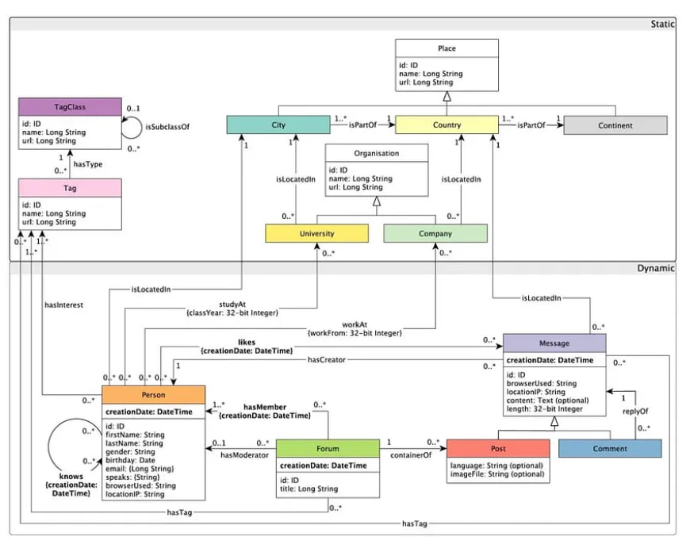

# Optimización de consultas del Social Network Benchmark en Neo4j.

## Estudio experimental

Estrategias de diseño físico para evaluar el impacto en el tiempo de ejecución de las consultas del **Social Network Benchmark** en la base de datos no relacional **Neo4j** (nodos, etiquetas y relaciones).

## Estrategias de diseño físico empleadas

**1- Reescritura de consultas.**

Un administrador de base de datos puede identificar patrones en la consulta que guíen la reescritura de la consulta en una consulta equivalente con un tiempo de ejecución mejorado.

- **Consulta mínima:** identificar y eliminar rutas duplicadas (o parte de la ruta) en la consulta.

- **Propiedades limitadas:** mover las operaciones de agregación en una declaración WITH antes de las declaraciones ORDER BY y LIMIT, y colocar la entrega de resultados al final de la consulta por medio de la declaración RETURN.


**2- Materialización de caminos.**

Consiste en generar una relación que representa una ruta precalculada, es decir, la ruta está precalculada y almacenada en una relación.
Particularmente, se determinó que la mejor estrategia es aplicar la materialización sobre los caminos que tienen mayor costo en DB Hits, la cual puede ser observado en los planes de ejecución de cada consulta.


**3- Creación de índice.**

## Esquema de la Base de Datos.



Imagen y datos generados de: *```https://github.com/ldbc/ldbc_snb_datagen_spark/blob/main/README.md```*
